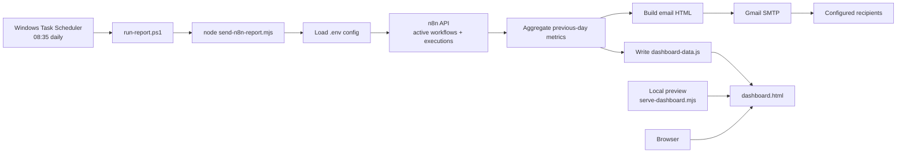

# Workflow Architecture

## How It Works

1. Windows Task Scheduler runs `run-report.ps1` every day at the configured time.
2. `run-report.ps1` starts `send-n8n-report.mjs` from the project directory.
3. The script loads credentials and settings from `.env`.
4. It calls the n8n API to fetch active workflows and recent executions.
5. It calculates the previous calendar day's summary, workflow stats, failures, and 7-day trend.
6. It sends the HTML health report through Gmail SMTP unless `REPORT_DISABLE_EMAIL=true`.
7. It writes the same aggregated data to `dashboard-data.js`.
8. `dashboard.html` reads `dashboard-data.js` and renders the dashboard.
9. For local review, `serve-dashboard.mjs` hosts the static dashboard on `http://127.0.0.1:4173/dashboard.html`.

## Main Files

- `send-n8n-report.mjs`: Core data fetch, aggregation, email rendering, and dashboard snapshot generation.
- `dashboard.html`: Static UI that renders the generated snapshot.
- `dashboard-data.js`: Generated data payload consumed by the dashboard.
- `run-report.ps1`: Entry point for scheduled runs.
- `register-report-task.ps1`: Registers the daily Windows scheduled task.
- `serve-dashboard.mjs`: Simple local static server for dashboard preview.
